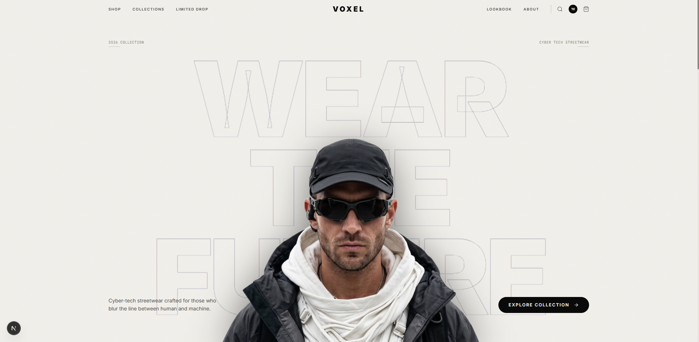

<br/>
<p align="center">
  <h1 align="center">VOXEL - Wear the Future</h1>
  <p align="center">
    A Cyber-Tech Streetwear E-Commerce Platform
    <br/>
    <br/>
  </p>
</p>

<p align="center">
  
  
  
  
  
  
  
  
</p>

<p align="center">
  <a href="https://voxel-frontend-navy.vercel.app">
    
  </a>
</p>

## About The Project

VOXEL is a modern, high-performance e-commerce platform built specifically for cyber-tech streetwear brands. It aims to deliver a futuristic visual experience with a minimal dark UI, neon accents, and smooth micro-interactions. The application is designed with a mobile-first approach, prioritizing performance and business scalability.

This project was built to demonstrate a complete, production-ready Fullstack Architecture using Next.js for the storefront and Laravel for a robust backend API.

## Key Features

### Storefront (User Facing)
- Premium Dark Streetwear UI: Editorial-style dark theme built with a pitch black and off-white contrast palette, neon cyan accents, and smooth entrance animations.
- Product Catalog: Dynamic grid layout with filtering (category, price, size) and search capabilities.
- Interactive Product Detail: Features multi-image galleries, interactive size guides, dynamic stock indicators, and real-time add-to-cart.
- Seamless Checkout Flow: Multi-step checkout process with real-time shipping rate calculation (via Biteship).
- Payment Gateway: Integrated with Midtrans for secure and diverse payment methods (E-Wallets, Virtual Accounts, Credit Cards).
- Smart Cart Logic: Dynamic free shipping calculation for orders exceeding specific thresholds.

### Admin Panel
- Product Management: Full CRUD capabilities including variants, sizing, and multi-image uploads.
- Order Tracking: Comprehensive order management and status updates.
- User Management: Monitor user activity and roles.
- Dashboard Analytics: Overview of total sales, orders, and revenue charts.

## Third-Party Integrations

- Payment Gateway: Midtrans (Snap API & Webhooks)
- Shipping / Logistics: Biteship API

## Getting Started

Follow these steps to run the project locally.

### Prerequisites
- Node.js (v18+)
- PHP (v8.2+)
- Composer
- PostgreSQL

### 1. Backend Setup (Laravel)

```bash
cd backend
# Install dependencies
composer install

# Copy environment file
cp .env.example .env

# Generate application key
php artisan key:generate

# Run database migrations and seeders
php artisan migrate --seed

# Start the Laravel development server
php artisan serve
```

### 2. Frontend Setup (Next.js)

```bash
cd frontend
# Install dependencies
npm install

# Copy environment file
cp .env.example .env.local

# Start the Next.js development server
npm run dev
```

### 3. Environment Variables

Make sure to configure your environment variables for both frontend and backend.

**Backend (backend/.env)**
```env
DB_CONNECTION=pgsql
DB_HOST=127.0.0.1
DB_PORT=5432
DB_DATABASE=voxel
DB_USERNAME=your_username
DB_PASSWORD=your_password

MIDTRANS_SERVER_KEY=your_server_key
MIDTRANS_CLIENT_KEY=your_client_key
MIDTRANS_IS_PRODUCTION=false

BITESHIP_API_KEY=your_biteship_api_key
```

**Frontend (frontend/.env.local)**
```env
NEXT_PUBLIC_API_URL=http://localhost:8000/api
NEXT_PUBLIC_STORAGE_URL=http://localhost:8000/storage
NEXT_PUBLIC_MIDTRANS_CLIENT_KEY=your_client_key
```

## Webhook Configuration (Local Development)

To test Midtrans payments locally, you will need to expose your backend using ngrok:

```bash
ngrok http 8000
```
Update your Midtrans Dashboard Payment Notification URL to:
`https://<your-ngrok-url>/api/payments/notification`


## License

This project is licensed under the [MIT License](LICENSE).